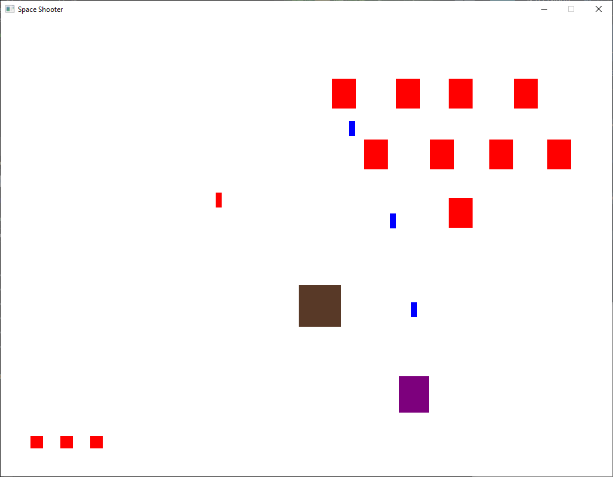

# Space Shooter Game

Game can be played in x64/Release folder

## Controls:
2 Red squares represent Start and Exit buttons

Keyboard: Left and Right arrow or A and D  for movement, SPACE for shooting.\
Mouse: Click to switch to mouse control, Left click to shoot.
ESC to open menu: First button resumes game, Second exits

## Game mechanics
Health displayed in the lower left corner.\
Player shoots enemies and dodges projectiles.\
Bonuses fall from destroyed enemies.

## Bonus types:
Heal by 1 point\
Increase shooting speed\
Increase projectile speed

